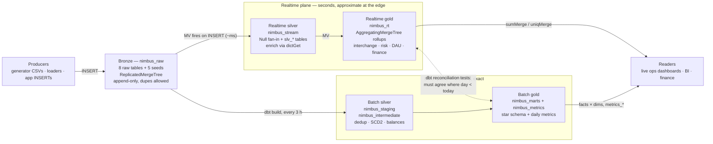
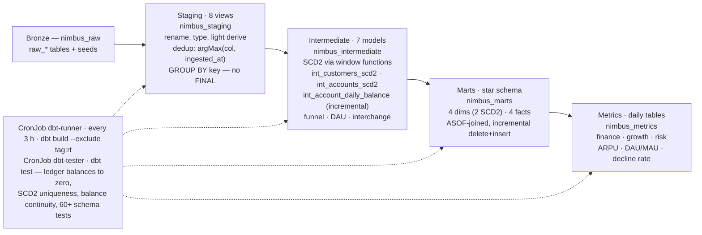
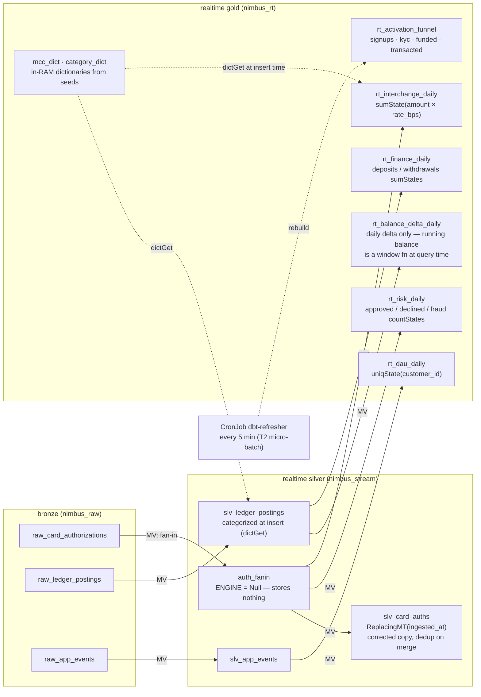
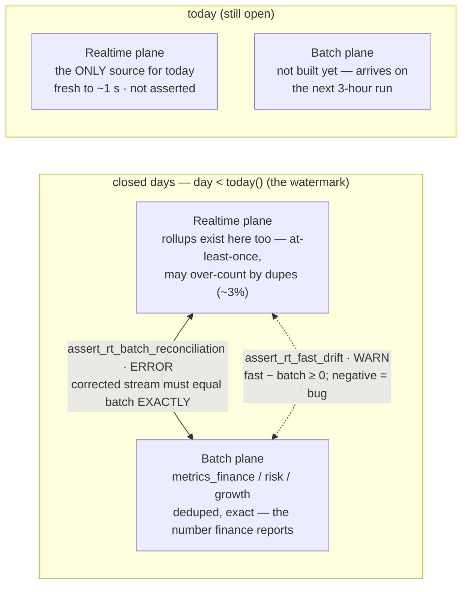

# Nimbus Warehouse — Realtime + Batch Architecture

One ClickHouse cluster serves both a batch star schema rebuilt every 3 hours and a
realtime plane that updates within seconds of an insert — reconciled by tests instead
of glued together by a merge view. This document is the helicopter view, then the
zoom-ins.

Contents (ordered as data flows):

0. [Prologue: follow one customer through the system](#0-prologue-follow-one-customer-through-the-system)
1. [The system at a glance](#1-the-system-at-a-glance)
2. [Why a lambda shape — and why one engine](#2-why-a-lambda-shape--and-why-one-engine)
3. [Bronze: the shared boundary](#3-bronze-the-shared-boundary)
4. [Zoom: the batch plane (truth)](#4-zoom-the-batch-plane--the-truth)
5. [Zoom: the realtime plane (speed)](#5-zoom-the-realtime-plane--the-speed)
6. [Zoom: the contract between the planes](#6-zoom-the-contract-between-the-planes)
7. [What stays batch, and why](#7-what-stays-batch-and-why)
8. [Operations: how it runs in production](#8-operations-how-it-runs-in-production)
9. [Decision log](#9-decision-log)

---

## 0. Prologue: follow one customer through the system

Before the boxes and arrows, walk one concrete story end to end. Meet customer
`cus_0042`, who signs up, passes KYC a day later, gets a card, and buys dinner. We
follow that data twice — once down the **batch** path (where it becomes versioned
history and audited revenue) and once down the **realtime** path (where it becomes a
dashboard number within a second). Every table below is what you would actually see
if you `SELECT`-ed at that moment.

### Step 1 — Bronze: the raw truth, warts and all

The customer record lands in `nimbus_raw.raw_customers`. The upstream system
re-delivers it once (network retry), so bronze holds **two identical rows** with
different `ingested_at` — bronze never deduplicates:

| customer_id | full_name | country | signup_ts | ingested_at |
|---|---|---|---|---|
| cus_0042 | Ayu Lestari | ID | 2025-11-03 09:12:00 | 2025-11-03 09:12:04 |
| cus_0042 | Ayu Lestari | ID | 2025-11-03 09:12:00 | **2025-11-03 09:12:31** ← re-delivery |

Status changes arrive separately, as immutable events in `raw_kyc_events`:

| customer_id | kyc_status | event_ts |
|---|---|---|
| cus_0042 | pending | 2025-11-03 09:12:00 |
| cus_0042 | verified | 2025-11-04 14:30:00 |

Six weeks later Ayu buys dinner. The authorization lands in
`raw_card_authorizations` — and this one also gets re-delivered (the load harness
deliberately re-inserts ~3% of auths to keep everyone honest):

| auth_id | card_id | mcc | amount_minor | approved | auth_ts | ingested_at |
|---|---|---|---|---|---|---|
| auth_9f31 | card_0042a | 5812 | 120000 | 1 | 2025-12-15 19:41:22 | 19:41:23 |
| auth_9f31 | card_0042a | 5812 | 120000 | 1 | 2025-12-15 19:41:22 | **19:43:10** ← duplicate |

Everything downstream is derived from these rows. Nothing ever updates them.

### Step 2 — Batch staging: one row per key, by `argMax`

`stg_customers` (a view) collapses the duplicate by taking each column's value at the
latest `ingested_at` — `argMax(col, ingested_at) … GROUP BY customer_id`, no `FINAL`:

| customer_id | full_name | country | signup_ts |
|---|---|---|---|
| cus_0042 | Ayu Lestari | ID | 2025-11-03 09:12:00 |

Same idiom in `stg_card_auths`: `auth_9f31` is one row again.

### Step 3 — SCD2: the customer becomes *versions*, not a row

`int_customers_scd2` joins the deduped customer to their KYC events and turns each
status change into a validity window, using `leadInFrame(change_ts)` to close the
previous version. Ayu is now **two rows** — her history:

| customer_id | kyc_status | valid_from | valid_to | is_current |
|---|---|---|---|---|
| cus_0042 | pending | 2025-11-03 09:12:00 | 2025-11-04 14:30:00 | 0 |
| cus_0042 | verified | 2025-11-04 14:30:00 | 2106-01-01 00:00:00 | 1 |

`dim_customers` materializes this with a deterministic surrogate key per *version*,
`customer_key = cityHash64(customer_id, valid_from)`:

| customer_key | customer_id | kyc_status | valid_from | valid_to |
|---|---|---|---|---|
| 771…402 | cus_0042 | pending | 2025-11-03 09:12:00 | 2025-11-04 14:30:00 |
| 118…935 | cus_0042 | verified | 2025-11-04 14:30:00 | 2106-01-01 00:00:00 |

Why this matters: any question about Ayu can now be answered *as of any point in
time*. "Was this auth made by a verified customer?" is not a lookup of her current
status — it is a join against the version that was valid **when the auth happened**.

### Step 4 — The fact row: joined as-of the event

`fct_card_authorizations` resolves each auth against the dimension version valid at
`auth_ts` (`ASOF LEFT JOIN … auth_ts >= valid_from`) and prices interchange from the
MCC seed (5812 = restaurants, 175 bps → `intDiv(120000 × 175, 10000) = 2100`):

| auth_id | date | customer_key | kyc_status @ auth | amount_minor | interchange_minor |
|---|---|---|---|---|---|
| auth_9f31 | 2025-12-15 | 118…935 | verified | 120000 | 2100 |

The auth on 2025-12-15 picked the **verified** version (key `118…935`) because the
event time falls inside that validity window. Had Ayu transacted on 2025-11-03, the
same query logic would have picked the *pending* version — re-running the pipeline
never rewrites that answer. From here, `metrics_finance_daily` rolls the 2100 minor
units into the day's audited `interchange_revenue_minor`.

That is the batch journey: it happened up to 3 hours after the fact, and it is exact.

### Step 5 — Rewind: the same auth, on the realtime clock

Now replay the dinner purchase as the realtime plane saw it, in wall-clock order:

| When | What happens |
|---|---|
| 19:41:23.0 | `INSERT` of `auth_9f31` into `raw_card_authorizations` begins on replica 1. |
| +ms, inside the INSERT | The fan-in MV fires, pushing the row through `auth_fanin` (a Null table — stores nothing) into three targets at once: `rt_interchange_daily` gets `sumState(+2100)` (rate looked up via `dictGet(mcc_dict, 5812)`, no join), `rt_risk_daily` gets approved `+1`, and `slv_card_auths` stores a corrected copy keyed on `auth_id`. |
| 19:41:23.1 | The INSERT returns. A dashboard running `sumMerge(interchange_minor)` **already includes dinner**. Replica 2 receives the bronze row and the rollup rows as replicated *data* — the MVs do not fire again (the single-fire keystone; §5). |
| 19:43:10 | The **duplicate** arrives. The rollups are at-least-once, so `rt_interchange_daily` now says **4200** for this auth — knowingly over-counted. `slv_card_auths` gets a second version of `auth_9f31`. |
| +minutes | A background merge collapses `slv_card_auths` (ReplacingMergeTree by `ingested_at`) back to one row. Anyone needing exactness *now* reads it with `argMax … GROUP BY auth_id` and gets 2100 without waiting. |
| next 3-h run | The batch spine rebuilds `metrics_finance_daily` (exact: 2100) and runs the contract: `assert_rt_fast_drift` logs the +2100 gap on the raw rollup as expected positive drift (warn); `assert_rt_batch_reconciliation` proves the *corrected* stream equals batch to the integer (error if not). |

Same event, two journeys: within one second it was on a dashboard (approximately);
within three hours it was in the books (exactly); and a scheduled test proved the two
stories agree. The rest of this document explains why every piece of that sentence is
shaped the way it is.

---

## 1. The system at a glance

Everything lives in one ClickHouse cluster (1 shard × 2 replicas, coordinated by a
3-node Keeper quorum, deployed by the Altinity operator under Flux GitOps). Producers
write to exactly one place — the bronze database `nimbus_raw` — and from there the
data forks into two planes that never block each other:

- The **batch plane** is a classic dbt medallion pipeline: staging → intermediate →
  marts → metrics, rebuilt by a CronJob every 3 hours. It is *correct*: deduplicated,
  SCD2-versioned, as-of joined, fully tested.
- The **realtime plane** is a cascade of ClickHouse materialized views that fire
  synchronously on every `INSERT` into bronze. It is *fast*: dashboard-ready
  aggregates advance within about a second of the write, with zero dbt runs involved.

One write path, two read paths. The same physical `INSERT` into `nimbus_raw` feeds
both planes: materialized views push it into `nimbus_stream`/`nimbus_rt` immediately,
and dbt re-reads it into the batch spine on the next 3-hour run. Nothing downstream
ever writes back to bronze.

## 2. Why a lambda shape — and why one engine

The workload is a neobank ("Nimbus"): card authorizations, a double-entry ledger,
app events, KYC. Two kinds of questions get asked of the same data, with incompatible
service levels:

- **"What is happening right now?"** — declines spiking, interchange revenue today,
  DAU so far. Freshness matters more than the last fraction of a percent of accuracy.
- **"What exactly happened?"** — month-end revenue, balance continuity, cohort
  behavior. Correctness is non-negotiable; a 3-hour lag is irrelevant.

Forcing one pipeline to serve both means either a slow "realtime" system or an
untrustworthy batch one. So the design is deliberately *lambda*: a speed layer and a
truth layer over the same immutable bronze. The classic objection to lambda is that
you maintain two stacks (a stream processor + a warehouse) and reimplement business
logic twice in two languages. Nimbus sidesteps most of that:

- **One engine.** Both planes are ClickHouse objects in the same cluster. There is no
  Kafka, no Flink, no second storage system. The "stream processor" is ClickHouse's
  own materialized-view mechanism, which runs the transform synchronously inside the
  insert.
- **One control plane.** Both planes are dbt models in the same project. Batch models
  are plain dbt materializations; realtime objects (tables, MVs, dictionaries) are
  deployed and versioned by dbt too, selected by `tag:rt`. One repo, one lineage
  graph, one test framework.
- **Logic is shared where it matters.** The seeds that price interchange
  (`seed_mcc_codes`) and classify ledger categories feed the batch joins *and* the
  realtime dictionaries, so both planes compute revenue from the same reference data
  with the same integer-bps arithmetic.

What remains genuinely duplicated — a daily interchange sum expressed once as a dbt
model and once as an MV — is exactly what the reconciliation tests in [§6](#6-zoom-the-contract-between-the-planes)
exist to police.

## 3. Bronze: the shared boundary

`nimbus_raw` is the fixed interface between ingestion and everything else. Ingestion
itself (CDC, Kafka, whatever the source estate becomes) is explicitly out of scope of
this design: as long as events arrive as inserts into these tables, both planes work
unchanged. Three properties make that possible:

- **Append-only, duplicates tolerated.** Producers may re-deliver (the load harness
  deliberately re-inserts ~3% of card auths with a later `ingested_at`). Bronze never
  tries to be clean; each plane deduplicates in its own idiom downstream.
- **Entity tables vs event tables.** Mutable entities (`raw_customers`,
  `raw_accounts`, `raw_cards`) use `ReplicatedReplacingMergeTree(ingested_at)` keyed
  on the entity id; immutable event streams (`raw_ledger_postings`,
  `raw_card_authorizations`, `raw_app_events`, KYC/account events) use plain
  `ReplicatedMergeTree`, partitioned by month on the event timestamp.
- **Every table is Replicated.** With 2 replicas, either node can serve reads and
  survive the other's restart; Keeper coordinates the replication log. This is also
  what makes the realtime plane's correctness argument work (§5).

## 4. Zoom: the batch plane — the truth

The batch plane is a conventional medallion pipeline, and that is a feature: every
hard modeling problem (slowly changing dimensions, historical joins, running
balances) is solved here once, with full SQL expressiveness and full test coverage,
on a predictable cadence.

Views until it gets expensive: staging and most intermediate models are views (zero
storage, always fresh relative to bronze); only the heavy hitters — daily balance,
DAU, facts, metrics — are materialized tables with incremental `delete+insert` over a
small lookback window.

Four design choices carry most of the weight here:

- **Dedup by `argMax`, not `FINAL`.** Staging collapses duplicates with
  `argMax(col, ingested_at) … GROUP BY key`. It costs a predictable aggregation
  instead of an unbounded merge-on-read, and it works identically on tables that
  aren't ReplacingMergeTree.
- **SCD2 via window functions, not snapshots.** Customer and account history is
  derived from the raw event streams with `leadInFrame(change_ts)` to close each
  validity window. dbt snapshots would need ClickHouse mutations, which are
  heavyweight; deriving history from immutable events is idempotent and replayable
  from bronze at any time.
- **Facts resolve dimensions as-of the event.** Each fact row picks the dimension
  version that was valid at event time via `ASOF LEFT JOIN … event_ts >= valid_from`,
  with surrogate keys like `cityHash64(customer_id, valid_from)`. Late re-runs
  produce the same keys — the star schema is deterministic.
- **Incremental with a lookback, not "since last run".** Facts and the daily balance
  reprocess a trailing window (3 days for balances, 1 for events) with
  `delete+insert` on the unique key. Late-arriving data inside the window self-heals;
  anything older is an explicit backfill.

## 5. Zoom: the realtime plane — the speed

The realtime plane contains *no scheduler, no consumer group, no polling loop*. It is
built from ClickHouse materialized views: an MV is a trigger that runs its `SELECT`
over each inserted block, synchronously, inside the producer's `INSERT`. When the
insert returns, the downstream rollups are already updated. That gives end-to-end
freshness of roughly one second — and it means the cost of realtime is paid by the
writer, in tiny per-block increments, instead of by a standing stream-processing
fleet.

Solid arrows are materialized views — they run inside the producer's `INSERT`, so
cascade depth is kept ≤ 2 on purpose. The Null-engine `auth_fanin` is the trick that
keeps it shallow: one MV reads bronze, and three targets subscribe to the Null table,
so adding a fourth rollup never deepens the chain or re-reads bronze.

The mechanics worth understanding, because they are where realtime systems usually go
wrong:

- **The correctness keystone: MVs fire on `INSERT`, never on replication.** On the
  1-shard × 2-replica cluster, an event is inserted on one replica; the MV aggregates
  it exactly once there, and both the bronze row and the *already-aggregated* rollup
  rows replicate as data. If MVs also fired on replicated blocks, every event would
  be counted twice. This single-fire property was validated empirically before
  anything else was built on it — it is the load-bearing wall of the whole plane.
- **Aggregate state, not results.** Realtime gold tables are `AggregatingMergeTree`
  holding `sumState`/`countState`/`uniqState`. Partial states from every insert block
  merge associatively in the background; readers finalize with
  `sumMerge`/`uniqMerge`. That is what makes "increment a daily total on every
  insert" safe under concurrent writes, merges, and replication — including exact
  distinct counts for DAU.
- **Dictionaries instead of joins.** An MV's SELECT runs per inserted block, so a
  join against a seed table on the hot path would be paid on every insert. Reference
  data is loaded into in-RAM dictionaries (`mcc_dict`, `category_dict`) and consulted
  with O(1) `dictGet` calls at insert time.
- **Honest dedup.** The continuous rollups are at-least-once: a duplicate insert
  increments them again (the observed drift is the deliberate ~3% dupe rate). The
  corrected stream `slv_card_auths` (ReplacingMergeTree keyed on `auth_id`) converges
  to exactly-once as merges run. Fast-but-approximate and slower-but-correct coexist
  *within* the realtime plane, and the reader picks per query.
- **Know when to stop.** ClickHouse refused refreshable MVs on Replicated targets (a
  known limitation, verified in the spike), so the activation funnel — a multi-stream
  join no insert-trigger can express — falls back to a 5-minute micro-batch. The
  design names its latency tiers explicitly rather than pretending everything is
  streaming.

| Tier | Mechanism | Freshness | Examples |
|---|---|---|---|
| **T0** continuous | MV cascade, fires in the INSERT | ~1 second | `rt_interchange_daily`, `rt_risk_daily`, `rt_finance_daily`, `rt_dau_daily` |
| **T1** merge-bounded | ReplacingMergeTree dedup, converges as merges run | seconds → minutes | `slv_card_auths` (exact auth stream) |
| **T2** micro-batch | CronJob `dbt-refresher` | 5 minutes | `rt_activation_funnel` |
| **T3** batch | CronJob `dbt-runner` | 3 hours | everything in §4 |

## 6. Zoom: the contract between the planes

Classic lambda merges the two planes at read time — a serving view that unions batch
results with the streaming tail. Nimbus deliberately does **not** build that view.
The planes serve different questions to different readers, and gluing them together
would smear the speed layer's known imprecision into the truth layer's numbers.
Instead, the relationship is a *verified contract*: the planes must provably agree
wherever they overlap.

Today belongs to the realtime plane; closed days belong to the batch plane; and on
every closed day two dbt tests hold the planes together — one demands exact equality
of the corrected stream, one watches the expected small over-count of the raw rollups
and alarms only if the drift ever goes *negative* (an under-count would mean lost
events).

Concretely, two singular tests run inside the batch spine every 3 hours:

- `assert_rt_batch_reconciliation` (**severity: error**) — for every `day < today()`,
  interchange revenue recomputed from the deduplicated stream, the streaming risk
  counts, and `uniqMerge(dau)` must equal `metrics_finance_daily`,
  `metrics_risk_daily` and `metrics_growth_daily` to the integer. Same math (integer
  basis-points arithmetic), independent paths. If this ever fails, one of the planes
  has a real bug — most plausibly a lost or double-fired MV event.
- `assert_rt_fast_drift` (**severity: warn**) — reports the signed gap between the
  at-least-once `rt_interchange_daily` and batch truth on closed days. A small
  positive drift is expected and documented; a negative drift is promoted to an
  incident, because the fast plane must never *lose* events.

A subtle but important detail: the reconciliation test references the streaming
tables by literal name rather than dbt `ref()`, so that the batch run
(`--exclude tag:rt`) still executes it. The batch spine is the enforcement point —
every 3 hours, the truth layer audits the speed layer.

> **Why tests instead of a merge view.** A lambda merge view answers "give me one
> number spanning both planes" by silently deciding, per query, which plane to trust.
> This design refuses that ambiguity: dashboards that need *now* read `nimbus_rt`
> knowing today is approximate at the edges; finance reads `nimbus_metrics` knowing
> it lags 3 hours; and the reconciliation tests guarantee the two stories converge on
> every closed day. Trust is established by continuous verification, not by
> query-time blending. (If a spanning view is ever needed, the watermark makes it
> trivial: batch where `day < today()`, realtime for today — the contract already
> proves the seam is clean.)

## 7. What stays batch, and why

The most production-relevant discipline in this design is refusing to stream things
that don't want to be streamed. Per-model, the boundary was decided on one question:
*can this be expressed as an associative, per-block aggregation?*

| Workload | Plane | Reasoning |
|---|---|---|
| Daily sums, counts, distincts (interchange, risk, DAU, cash flows) | realtime | Perfectly associative — `*State`/`*Merge` handles blocks, merges and replicas for free. |
| Stream dedup | realtime | ReplacingMergeTree gives eventual exactness; readers needing it now pay `argMax` at query time. |
| Running account balance | hybrid | Deltas stream (`rt_balance_delta_daily`); the cumulative sum is a query-time window function. Streaming a running total would make every event depend on all prior events — not block-associative. |
| Activation funnel | T2 · 5 min | Multi-stream join with ordering semantics; no MV can express it, so it is honestly micro-batched. |
| SCD2 dimension history | batch | Closing a validity window rewrites the *previous* row — inherently a look-back over the whole entity history. |
| As-of fact↔dim joins, surrogate keys | batch | Needs the finished SCD2 timeline; ASOF joins on the insert path would be wrong the moment a dimension closes a window. |
| MAU / stickiness / cohorts | batch | 28-day sliding windows over deduplicated users — cheap to recompute, painful to maintain incrementally. |
| Month-end / reported numbers | batch | By definition the audited path: fully tested, deterministic, replayable from bronze. |

## 8. Operations: how it runs in production

### Everything is GitOps

Flux reconciles the whole stack from declarative manifests with explicit dependency
order: operator CRDs → clickhouse-operator → Keeper (`keeper-chk`) → the ClickHouse
installation (`clickhouse-chi`) → the dbt CronJobs (`dbt-runner` Kustomization). The
dbt project ships as a container image (`nimbus/dbt-runner`); changing a model is a
git commit, an image build, and a Flux sync — no human runs SQL against production.

### Two run modes, one manifest

The batch spine and the realtime plane deploy differently because they fail
differently:

- **Batch** — `dbt build --exclude tag:rt`, every 3 hours, idempotent, safe to
  re-run. Tests ride along; a red run is an alert.
- **Realtime** — `dbt run --select tag:rt`, on change only. Routine MV logic changes
  apply in-place via `ALTER TABLE … MODIFY QUERY` with zero downtime. Crucially,
  `--full-refresh` on `tag:rt` **drops live MVs** — events inserted during the gap
  are silently never aggregated — so it is reserved for maintenance windows, followed
  by an explicit backfill.

### Backfill and replay

Because bronze is immutable and the fan-in is a Null table, the realtime plane can
always be rebuilt: truncate the affected rollups, then re-insert bronze history
*through* `auth_fanin` so the same MVs recompute it (`make wh-rt-backfill`). Never
`POPULATE` — it races with live inserts. The batch plane backfills the boring way:
incremental models re-run over an explicit date window.

### Least privilege & observability

dbt runs as a scoped `dbt` user granted exactly the seven `nimbus_*` databases
(enumerated, no wildcard) plus what replication requires. Realtime health is
observable from system tables: `system.query_views_log` shows every MV fire, its
latency and exceptions; `system.replicas` shows both planes' replication lag; the
drift test turns silent divergence into a scheduled, visible signal.

## 9. Decision log

| Decision | Instead of | Because |
|---|---|---|
| Lambda inside one ClickHouse cluster | Kafka + Flink/ksqlDB speed layer | Same engine, same SQL, same ops surface; MVs give sub-second freshness without a second distributed system. |
| Reconciliation tests as the plane contract | Query-time lambda merge view | Keeps approximate and exact numbers from blending; agreement is proven every 3 h instead of assumed. |
| Null-table fan-in, cascade depth ≤ 2 | Chained MV pipelines | MVs run inside the producer's INSERT; shallow cascades bound insert latency and isolate blast radius. |
| AggregatingMergeTree partial states | Incrementing result tables | Associative states are the only construct that survives blocks, merges and replication without double-counting. |
| SCD2 by window functions over events | dbt snapshots / mutations | ClickHouse mutations are heavyweight; deriving history from immutable events is idempotent and replayable. |
| `argMax` dedup in staging | `FINAL` everywhere | Predictable aggregation cost; keeps merge-on-read off the hot path. |
| Micro-batch fallback for the funnel | Forcing it into an MV / refreshable MV | Refreshable MVs are refused on Replicated targets; an honest 5-minute tier beats a broken 1-second one. |
| dbt as the single control plane (`tag:rt`) | Hand-managed DDL for streaming objects | One repo, one lineage graph, one test runner, one deployment path for both planes. |

---

*Nimbus warehouse on k8s-clickhouse · ClickHouse 26.3 (Altinity operator 0.27.1),
1 shard × 2 replicas + 3-node Keeper · dbt-clickhouse, Flux GitOps on k3d ·
databases `nimbus_raw → staging → intermediate → marts/metrics` (batch) and
`nimbus_stream → nimbus_rt` (realtime). Companion sources:
`docs/plan/warehouse-architecture.md`, `docs/plan/realtime-warehouse-architecture.md`,
`warehouse/README.md`.*
